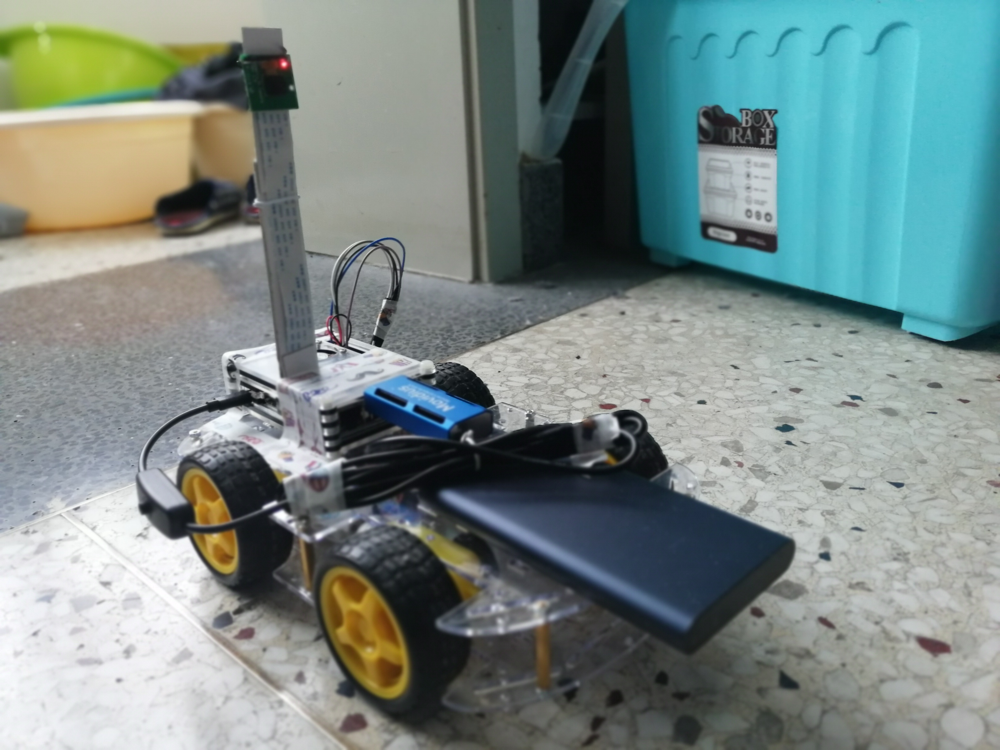

# **Embedded-Real-time-Object-Detection-System**
#### 冯如杯项目-嵌入式实时对象检测系统

### 北航17级计算机学院冯如杯项目小组：程添红，刘子明，丛睿轩，尹俊成

 项目内容：

硬件：树莓派（带网络摄像头），Modivius神经计算棒，智能小车 

功能：在树莓派上部署Mobinenet_SSD，NCS加速棒对图像推理加速，PC端通过xrdp远程连接树莓派，控制小车的移动

- [Github网页操作教程]: https://blog.csdn.net/kabulore/article/details/51801337

- [Github桌面版教程]: https://www.jianshu.com/p/06a960d991aa

- 大家建立自己的分支，命名如：cth，讨论后再合并到master，大家有更新就pull request
- 项目基于demo：https://www.cnblogs.com/yangykaifa/p/7305081.html
- 树莓派教程(杨老师版)：https://pan.baidu.com/s/12W7iphoFuBxd6tRxNhOxPg https://pan.baidu.com/s/1reEf7SRjp6oxWqfTfh6jBg
- 网络教程： https://www.jianshu.com/p/467335f07e05 https://blog.csdn.net/tavox/article/details/70994392 https://www.cnblogs.com/lihanxiang/p/8449025.h
- VNC： https://www.jianshu.com/p/467335f07e05 https://blog.csdn.net/tavox/article/details/70994392 https://blog.csdn.net/wanyeye/article/details/52879807
- 小车： https://www.cnblogs.com/lihanxiang/p/8449025.html https://www.cnblogs.com/lihanxiang/p/8451299.html https://www.cnblogs.com/lihanxiang/p/8451818.html
- 目标检测网络demo：https://blog.csdn.net/leadai/article/details/79737226
- SiameseFC的tf：https://blog.csdn.net/sansanfree/article/details/79718734 
- siamese源码：https://github.com/lzane/SiamFC-tf （8 stars） 
- siamese源码：https://github.com/bilylee/SiamFC-TensorFlow （179 stars） 
- siamese源码： https://github.com/torrvision/siamfc-tf （455 stars）
- tensorflow中文文档：https://tensorflow.juejin.im/get_started/