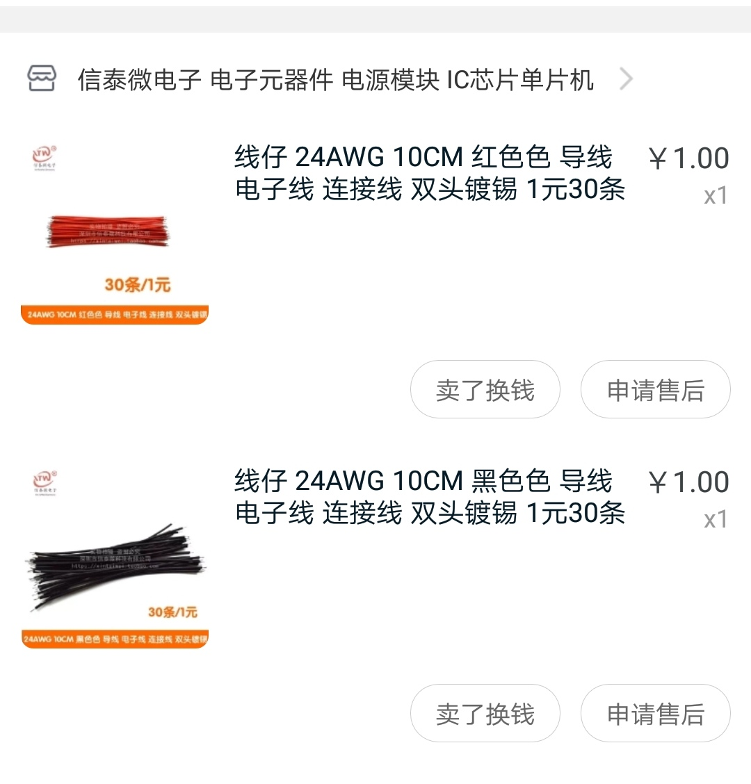
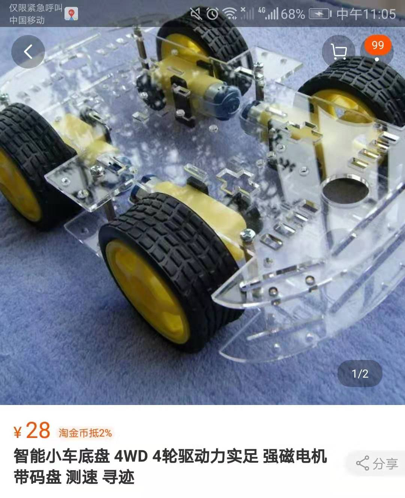
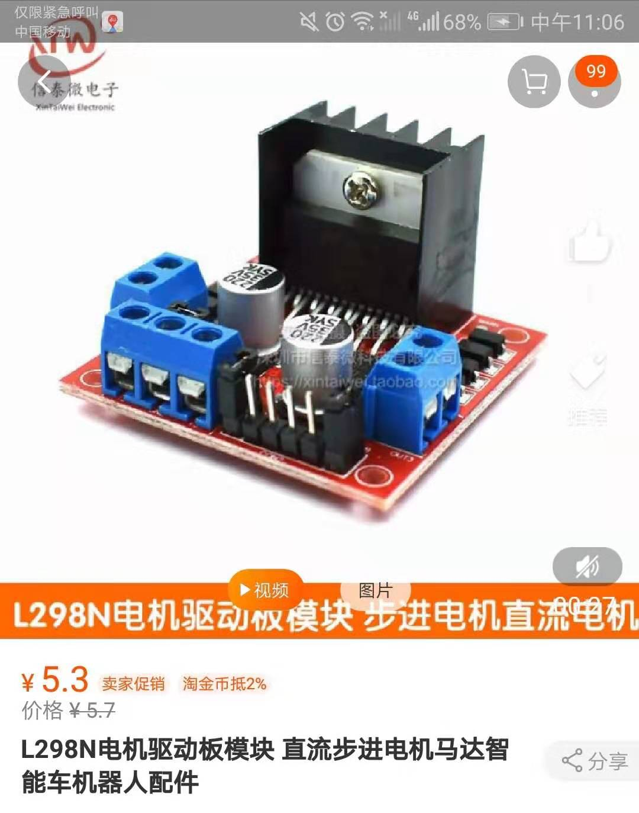
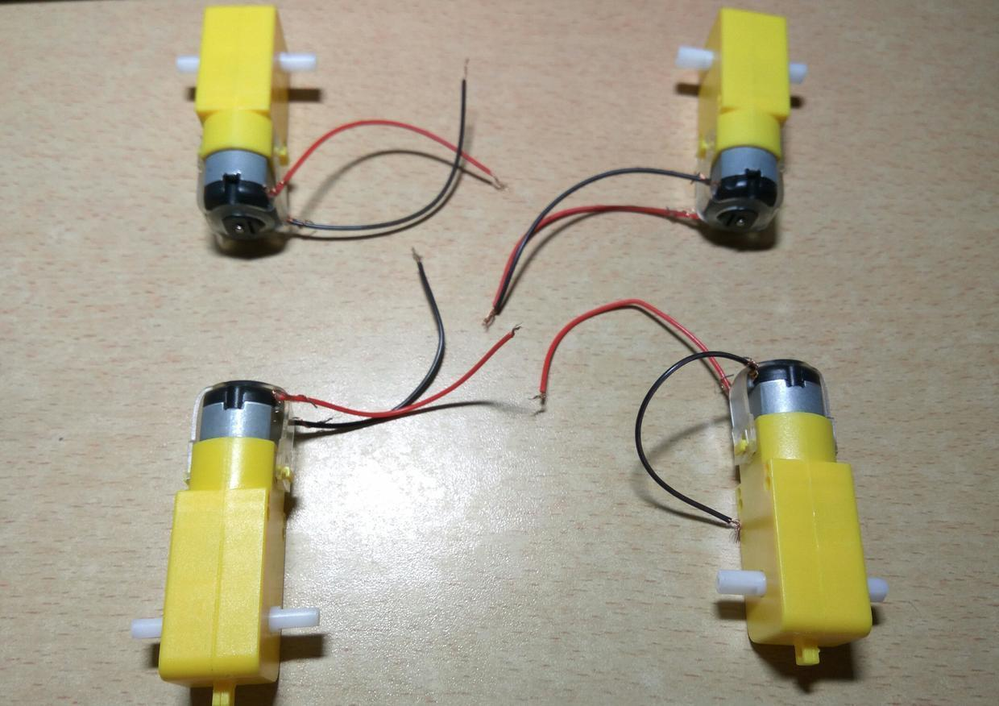
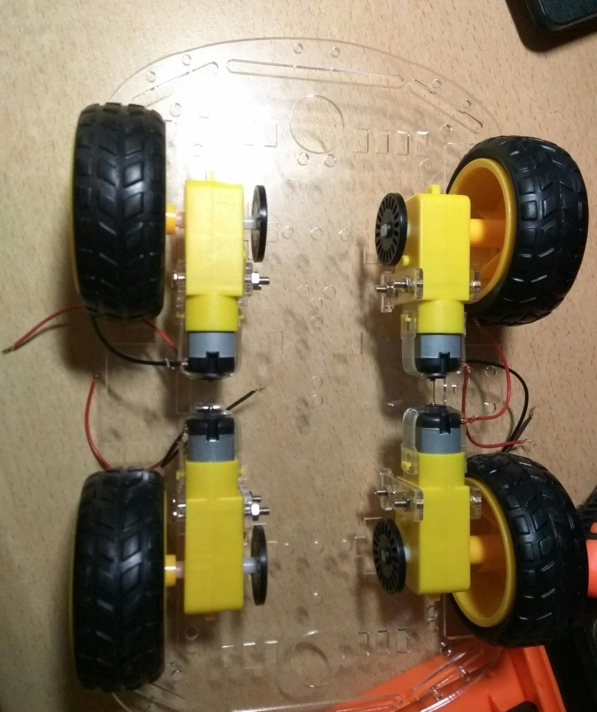
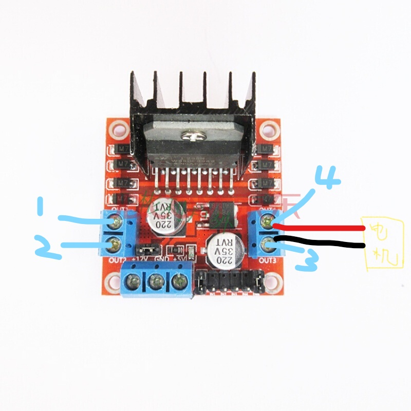
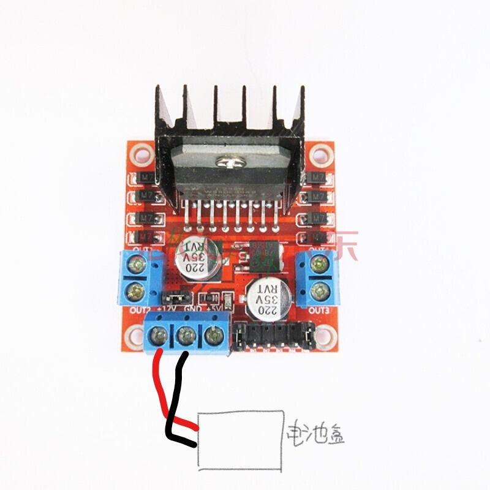
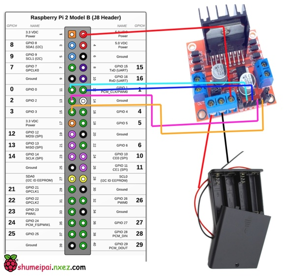

树莓派小车的安装

​	1.首先在网上购买小车所需的配件

​		I.树莓派1只(型号3B+)

​		II.小车底盘，四只直流电机，四个车轮，测速码盘，螺丝、螺帽、紧固件若干

​		III.电池盒

​		IV.4节5号电池（建议买充电电池，小车耗电量太大了）

​		V.L298N驱动板

​		VI.充电宝（必须有2A输出的）

​		VII.杜邦线若干（公对公，母对母，公对母）

​		VIII.红黑导线若干

​		VIIII.大号小号螺丝钉各一个

​	2.安装小车

​		I.电机连接

​			先用剪刀将导线的皮去掉，露出里面的电线，连在电机裸露的铜环处，正负极先不需要关心。

​		II.底盘的连接

​			先用紧固的小部件将电机和底盘相连，固定后将车轮固定在电机上。

​		III.L298N驱动板连接

​			将两边的四个电机的负极连至L298N的OUT1和OUT3处，正极连至OUT2和OUT4处。电机的正负极		作用是用来确定车轮旋转的方向(注意电机正负极如果不确定的话，只要保证同一个电机上两条电线连在		不同接口即可，后期可以通过代码的调试确定电机正负极)

​			电线连接时先用小螺丝刀拧开L298N螺钉，将电线插入小孔，然后拧紧螺钉即可

​		IV.驱动板与电池盒连接

​			电池盒自带电线，红线与正极相连，黑线与负极相连。

​		V.驱动板与树莓派连接

​			树莓派自带接口，其接口各自功能如下所示。

​			树莓派与控制板连接时我们用到了BOARD引脚编码中的2号，11号，12号，13号，15号

​		11号与IN1相连，12与IN2相连，13与IN3相连，15与IN4相连。

​		VI.充电宝与树莓派连接

​		VII.将小车的另一个底盘与小车相连

​		至此，小车的安装已经全部完成，但是在安装过程中对于小车的整体设计需要提前构思好，充分利用好	每一部分的空间，否则最后无法将各个部件构成一个整体。

​	3.小车运行

​		首先明确小车运行的原理：充电宝对树莓派进行供电，电池对小车进行供电，树莓派通过代码控制小车	的前进。

​		I.先为树莓派安装GPIO库

​			Raspbian中安装了两个Python版本，分别是2.7.3和3.2.2。Python2.x的安装包会一python为前		缀，而Python3.x的安装包回忆python3为前缀。	

​			Python2安装GPIO库需要输入命令：sudo apt-get install python-rpi.gpio

​			Python3安装GPIO库需要输入命令：sudo apt-get install python3-rpi.gpio

​		II.书写Python代码

	import RPi.GPIO as GPIO
				import time
				import os
				import subprocess as call
	
	​			GPIO.setmode(GPIO.BOARD)
	​			IN1 = 11   						#左前轮
	​			IN2 = 12   						#左后轮
	​			IN3 = 13   						#右前轮
	​			IN4 = 15   						#右后轮
	​			def init():  					#定义接口
	​    			GPIO.setup(IN1, GPIO.OUT)
	​    			GPIO.setup(IN2, GPIO.OUT)
	​    			GPIO.setup(IN3, GPIO.OUT)
	​    			GPIO.setup(IN4, GPIO.OUT)
	
	​			def moveForward():  			#前进
	​    			GPIO.output(IN1, GPIO.HIGH)         
	​    			GPIO.output(IN2, GPIO.LOW)          
	​    			GPIO.output(IN3, GPIO.HIGH)
	​    			GPIO.output(IN4, GPIO.LOW)
	​    			time.sleep(1)
	
	​			def moveBackground(): 			#后退
	​    			GPIO.output(IN1, GPIO.LOW)
	​    			GPIO.output(IN2, GPIO.HIGH)
	​    			GPIO.output(IN3, GPIO.LOW)          
	​    			GPIO.output(IN4, GPIO.HIGH)
	​    			time.sleep(1)
	
	​			def spinLeft():     			#左转
	   			 	GPIO.output(IN1, False)        
	​    			GPIO.output(IN2, False)
	​    			GPIO.output(IN3, GPIO.HIGH)
	​    			GPIO.output(IN4, GPIO.LOW)
	   			 time.sleep(0.5)
	
	​			def spinRight():    			#右转
	   			 	GPIO.output(IN1, GPIO.HIGH)
	​    			GPIO.output(IN2, GPIO.LOW)          
	​    			GPIO.output(IN3, False)
	​    			GPIO.output(IN4, False)
	​    			time.sleep(0.5)
	
	​			def stop():         			#停止
	​    			GPIO.output(IN1, False)
	​    			GPIO.output(IN2, False)          
	​    			GPIO.output(IN3, False)
	​    			GPIO.output(IN4, False)
	
	​			def raw_input(content):
	​    			return str(input(content))
	
	​			init()
	
	​			if __name__ == "__main__":
	​    			try:
	​        			while True:  
	​           			 					#Get command from user
	​           			 os.system ("clear")
	​           			 print ("W = forward")
	​            			 print ("S = background")
	​           			 print ("A = left")
	​           			 print ("D = right")
	​           			 print ("Q = stop")
	​				 command = raw_input("Enter command(Q to quit)")
							if (command == "w" or command == "W" ):
	​							moveForward()
	​							stop()
	​							continue
							elif (command == "a" or command == "A" ):
	​							spinLeft()
	​							stop()
	​							continue
							elif (command == "s" or command == "S" ):
	​							moveBackground ()
	​	 						stop()
	​	 						continue
							elif (command == "d" or command == "D" ):
	​							spinRight()
	​							stop()
	​							continue
							elif ("q" == command or "Q" == command):
	​							stop()
	​							GPIO.cleanup()
	​							break
							else:
	​	 						print("Enter Error")
	​							continue
						except (KeyboardInterrupt, SystemExit):
	​						stop()
	​	 					GPIO.clearup()

​		通过运行python文件，键盘上w a s d控制小车运行即可。

​		前面提到电机正负极的判断，可以单独执行小车向某一方向运动的python文件，根据车轮转动情况确定	四个电机正负极是否装反。

​		至此，小车的安装和运行全部完成。-